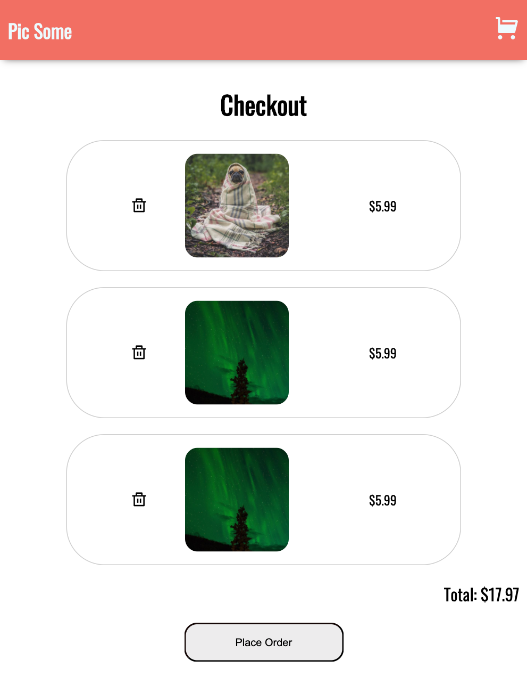

# **Pic Some**

Small photo purchasing site with React Hooks.

## Homepage

View photos and hover to mark as favorite or add to cart.

## Cart

Displays thumbnail of each photo with price and trash can to remove from cart. Total price is calculated at bottom near order button.

# **React Info**

- React Router DOM for navigation
  - `BrowserRouter`, `Switch`, `Route`, `Link`, and `useHistory`
- `GlobalStore` provider component with `React.createContext()`
- `withGlobalStore` higher order component to consume provider
- `useEffect` to `fetchPhotos`
- `useReducer` to dispatch global state changes
- `useState` for local state changes (e.g. image onLoad, hover, etc.)
- `React.memo` to memoize components for conditional re-renders
- `PropTypes` for type checking
